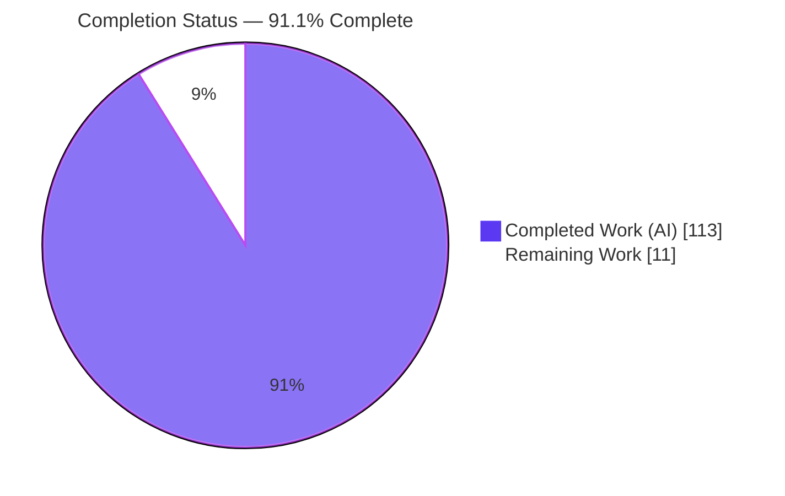
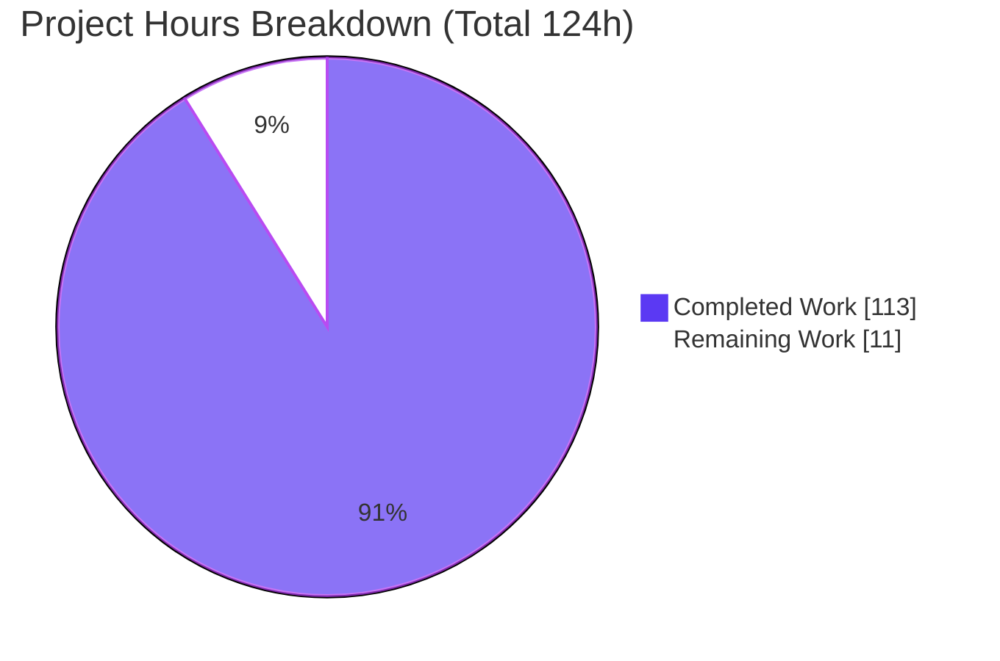
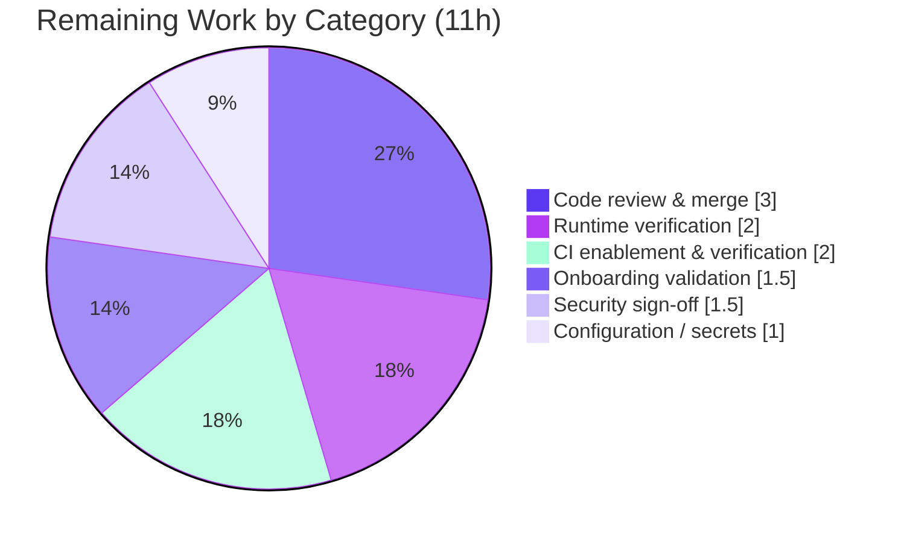

# W5Base / Darwin — Containerized Local Development Environment
## Blitzy Project Guide

> **Brand color legend** — Completed / AI Work: **Dark Blue `#5B39F3`** · Remaining / Not Completed: **White `#FFFFFF`** · Headings / Accents: **Violet-Black `#B23AF2`** · Highlight: **Mint `#A8FDD9`**

---

# 1. Executive Summary

## 1.1 Project Overview

This project delivers a reproducible, one-command **containerized local development environment** for W5Base ("Darwin") — a GPL-2.0, metadata-driven Perl application/database framework most often deployed as a CMDB/ITSM platform — together with authoritative onboarding and architecture documentation grounded in a verified working build. It targets engineers onboarding to the codebase and replaces a legacy Debian-5.0/SVN install recipe with a modern **Debian 12 + Apache (prefork MPM) + mod_perl2 + MariaDB** stack. The change is **purely additive**: no application logic, kernel, or schema is touched. Business impact: dramatically lower onboarding friction — a new engineer runs `docker compose up --build` and reaches a running, logged-in main menu.

## 1.2 Completion Status

The project is **91.1% complete** on an AAP-scoped basis. **100% of the autonomous engineering** (all 16 AAP requirements across 18 files) is delivered and validated end-to-end; the remaining **11 hours** are standard human handoff activities that an autonomous agent structurally cannot perform (provisioning real secrets, approving a merge, running CI on the team's own hosted infrastructure, and a newcomer onboarding dry-run).



| Metric | Hours |
|---|---|
| **Total Hours** | **124** |
| Completed Hours (AI + Manual) | 113 |
| &nbsp;&nbsp;• Completed — AI (autonomous) | 113 |
| &nbsp;&nbsp;• Completed — Manual (human) | 0 |
| **Remaining Hours** | **11** |
| **Percent Complete** | **91.1%** |

> Formula: `Completed ÷ Total = 113 ÷ 124 = 91.1%`.

## 1.3 Key Accomplishments

- [x] **One-command environment achieved** — `docker compose up --build` stands up the full stack; the main menu renders at `${W5BASE_BASE_URL}/w5base/auth/base/menu/root` (the AAP's primary acceptance signal).
- [x] **Purely additive** — 18 files added, **4,677 lines added, 0 removed**; `lib/`, `mod/`, `bin/`, `sbin/`, `sql/`, `etc/`, `README.txt` verified unchanged vs `master` (Backward Compatibility rule provably honored).
- [x] **Modernized containerization** — Debian 12 + Apache **prefork MPM** (mandatory for mod_perl2) + mod_perl2 + `Apache::DBI`; the legacy Debian-5.0/SVN recipe replaced with a pinned, reproducible image.
- [x] **Deterministic bootstrap** — a 14-step entrypoint creates the service account + runtime dirs, templates the three `/etc/w5base` configs, provisions the DB with modern `CREATE USER`/`GRANT`, builds the schema non-interactively (`TableVersionCheck` → **193 tables**), seeds `MASTERADMIN`, starts `W5Server`, and runs Apache in the foreground.
- [x] **Health-gated reliability** — the app waits for a fully authenticated DB healthcheck (`service_healthy`) before startup; MySQL timeout tuning applied.
- [x] **Mandatory test coverage** — a 786-line smoke/health-check asserts five signals (**5/5 pass**) plus a **14/14** self-test regression harness with anti-false-pass guards.
- [x] **Authoritative documentation** — `ARCHITECTURE.md` (10 sections), `LOCAL_SETUP.md` (8 sections), and three module guides — narrating *what/why/how*, grounded in the live environment.
- [x] **Security posture** — no hardcoded secrets; `.env` git-ignored; legacy `dummy/admin`//`acache` defaults changed; SQL-injection-safe DB provisioning; least-privilege `GRANT`; bcrypt HTTP Basic.

## 1.4 Critical Unresolved Issues

**No release-blocking in-scope issues.** The three items below are documented upstream kernel/schema artifacts that are explicitly out of scope (the AAP scopes `lib/`, `mod/`, `sql/` as read-only and mandates *STOP-and-FLAG* rather than editing application code). None blocks acceptance.

| Issue | Impact | Owner | ETA |
|---|---|---|---|
| Quirks-Mode HTML emitted by the read-only kernel (`mod/base`) | Cosmetic only; no functional impact; a benign browser console notice | Upstream maintainers (out of scope) | N/A — not fixable without violating minimal-change |
| Help icon links to `http://find.telekom.de/` (hardcoded upstream in kernel/skin) | Cosmetic; not an environment defect | Upstream maintainers (out of scope) | N/A |
| `sql/itil/itinv.sql` missing `# DEPEND itil/itinvautodisc.sql` (upstream schema-ordering defect) | Handled: entrypoint reconciles it at **runtime** (pre-applies DDL + re-runs `TableVersionCheck`), no source edit — backward-compatible | Resolved at runtime (Blitzy) | Done (runtime workaround in place) |

## 1.5 Access Issues

**No access issues were encountered during autonomous delivery** — the repository was cloned, Docker Engine 28.x + Compose were available, and the from-scratch network build succeeded. The following access dependencies belong to the human handoff and did **not** block autonomous work:

| System/Resource | Type of Access | Issue Description | Resolution Status | Owner |
|---|---|---|---|---|
| Team GitHub organization | Push / Actions | CI (`.github/workflows/smoke.yml`) is authored and YAML-valid but has not run on a GitHub-hosted runner (requires a push to the team's org) | Pending human action (HT-4) | Repository maintainer |
| Production-grade dev secrets | Credential authority | Real values for `.env` (DB/admin passwords) must be set by a human; the AI intentionally never sets real secrets | Pending human action (HT-1) | Repository maintainer |

## 1.6 Recommended Next Steps

1. **[High]** Provision real secrets in `.env` (`cp .env.example .env`; set strong `W5BASE_DB_PASSWORD`/`MYSQL_*`/`W5BASE_ADMIN_PASSWORD`; change legacy `dummy/admin`//`acache`). — *1h*
2. **[High]** Run the first from-scratch bring-up on your host and confirm the smoke test passes 5/5. — *2h*
3. **[Medium]** Review the 18-file, additive-only diff and merge to `master`. — *3h*
4. **[Medium]** Enable and verify the CI smoke workflow on a GitHub-hosted runner. — *2h*
5. **[Medium]** Have a second engineer complete a cold newcomer onboarding dry-run of `docs/LOCAL_SETUP.md`. — *1.5h*

---

# 2. Project Hours Breakdown

## 2.1 Completed Work Detail

All rows below are AAP-scoped deliverables completed autonomously and validated. **Total = 113 hours** (matches Completed Hours in §1.2).

| Component | Hours | Description |
|---|---:|---|
| `Dockerfile` | 12 | Debian 12 (pinned) + Apache prefork + mod_perl2 + `Apache::DBI`; full system Perl set with Debian-12 package-rename corrections + kernel/`W5InstallCheck` extras; `Digest::SHA1` fail-fast from CPAN; vendored `dependence/mandatory` modules (RPC::Smart, Env::C, HTML::TagFilter) built at image time; service account + runtime dirs; explicit source COPY (no secrets/VCS) |
| `docker-compose.yml` | 8 | Two-service orchestration (`db` MariaDB 10.11 pinned + `w5base`); health-gated ordering (`depends_on: service_healthy`); authenticated DB healthcheck + `W5Server` TCP healthcheck; `env_file`; named volume; port `8080:80` |
| `.env.example` + `.gitignore` | 3 | Complete env-var template (placeholders only, security guidance) + secret-protection ignore rules (ignore `.env`, keep `.env.example`) |
| `docker/entrypoint.sh` | 20 | 14-step bootstrap: env derive + DSN normalization, service account + dirs, whitelist-`envsubst` config render (0640), bcrypt htpasswd, DB wait, modern `CREATE USER`/`GRANT` (injection-safe), `TableVersionCheck`, runtime schema-ordering reconciliation (no source edit), idempotent `MASTERADMIN` seed, `W5Server` start + probe, Apache foreground |
| `docker/apache/w5base.conf` | 4 | mod_perl2 prefork vhost realizing the `$W5V2::INSTDIR` + `require sbin/ApacheStartup.pl` + `PerlModule Apache::DBI` preload contract; rewrite routing to `bin/app.pl` |
| `docker/w5base/*.conf.tmpl` (×3) | 4 | `databases.conf` / `w5server.conf` / `w5base.conf` templates (`DATAOBJCONNECT`/`USER`/`PASS`, `INCLUDE databases.conf`, `MASTERADMIN`) |
| `docker/mysql/my.cnf` | 2 | `sql_mode=""` (legacy `0000-00-00` defaults) + `net_read_timeout`/`net_write_timeout`/`wait_timeout` tuning |
| `docs/ARCHITECTURE.md` | 10 | 10-section architecture overview (framework model, request path, control plane, `TableVersionCheck`, filesystem, config model, operation modes, security, runtime topology, next steps) |
| `docs/LOCAL_SETUP.md` | 8 | 8-section onboarding runbook (prerequisites, single command, first login, health verification, security, full troubleshooting, operation modes, references) |
| `docs/modules/{kernel,itil,crm}.md` | 12 | Three module guides (10 sections each) with verified-against-repo claims and backward-compatibility notes |
| `README.md` | 1 | Additive quick-start pointer (legacy `README.txt` untouched) |
| `tests/smoke/w5base_smoke_test.sh` | 12 | 786-line smoke/health-check: 5 checks + `--self-test` regression harness + anti-false-pass guards (body inspection, dual exit+marker check, link-follow) |
| `.github/workflows/smoke.yml` | 3 | CI: builds the Compose stack and runs the smoke test |
| Environment integration, QA fix cycles & E2E validation | 14 | Full-stack integration/debugging across six review/QA gates (CP1, QA-1, QA-2, CP2, FINAL-B, FINAL-E) + from-scratch build, runtime bring-up, and browser verification |
| **Total** | **113** | |

## 2.2 Remaining Work Detail

All rows are path-to-production human handoff activities. **Total = 11 hours** (matches Remaining Hours in §1.2 and the pie chart in §7).

| Category | Hours | Priority |
|---|---:|---|
| Configuration / secrets provisioning (set real `.env` values; change legacy defaults) | 1.0 | High |
| Runtime verification (first from-scratch bring-up on team host + smoke test 5/5) | 2.0 | High |
| Code review & merge to `master` (18 files, ~4,677 lines, additive-only) | 3.0 | Medium |
| CI enablement & verification on a GitHub-hosted runner | 2.0 | Medium |
| Onboarding validation (cold newcomer dry-run of `LOCAL_SETUP.md`) | 1.5 | Medium |
| Security sign-off & secret hygiene | 1.5 | Low |
| **Total** | **11.0** | |

## 2.3 Hours Reconciliation

| Check | Result |
|---|---|
| §2.1 Completed total | 113 h |
| §2.2 Remaining total | 11 h |
| §2.1 + §2.2 | **124 h = Total (§1.2)** ✓ |
| Remaining consistency (§1.2 = §2.2 = §7) | 11 = 11 = 11 ✓ |
| Completion % | 113 ÷ 124 = **91.1%** ✓ |

---

# 3. Test Results

W5Base ships **no unit-test framework**; per the AAP's mandatory *Require Test Coverage* rule, the smoke/health-check is the test suite. All results below originate from Blitzy's autonomous validation logs and were **independently re-confirmed this session** (`--self-test` exits 0; `shellcheck` clean; `docker compose config` valid).

| Test Category | Framework | Total Tests | Passed | Failed | Coverage % | Notes |
|---|---|---:|---:|---:|---:|---|
| Smoke / Health-Check | Custom Bash harness | 5 | 5 | 0 | 100% (of 4 AAP-mandated signals + 1 navigability check) | Run on a true from-scratch stack (`down -v` + `up`): W5Server up; main menu HTTP 200 with real menu frameset; `W5InstallCheck` healthy; `TableVersionCheck` clean (exit + marker); generated menu link resolves under `/w5base` |
| Smoke Self-Test (regression) | Custom Bash harness (`--self-test`) | 14 | 14 | 0 | 100% | `W5ServerPort` parser + Check-4 error-marker detector (incl. DB-down detection, benign-"error" non-false-positive) |
| Static Analysis (scripts) | `bash -n` + ShellCheck | 2 | 2 | 0 | 100% | `entrypoint.sh` + smoke test: exit 0, zero warnings |
| Config / Manifest Validation | `docker compose config` + YAML | 2 | 2 | 0 | 100% | Compose file + CI workflow valid |
| **Totals** | | **23** | **23** | **0** | **100%** | Zero blocked/skipped tests |

---

# 4. Runtime Validation & UI Verification

Summary of the autonomous end-to-end bring-up (from-scratch `docker compose up --build` on an empty database) and in-browser verification.

**Runtime health**
- ✅ **Health-gated ordering** — `db` reached *Healthy* before `w5base` started (`depends_on: service_healthy`).
- ✅ **14-step entrypoint bootstrap** — config render → modern `CREATE USER`/`GRANT` → `TableVersionCheck` → **193 tables** → `MASTERADMIN` seed → `W5Server` listening → Apache foreground.
- ✅ **W5Server control plane** — listening on `127.0.0.1:12833` (IPv4 loopback bind).
- ✅ **Apache prefork + mod_perl2** — `apachectl -M` shows `mpm_prefork_module` + `perl_module`; threaded MPMs disabled.

**API / HTTP integration**
- ✅ **Main menu** — HTTP **200** at `/w5base/auth/base/menu/root` (authenticated).
- ✅ **Auth enforced** — **401** for unauthenticated requests.
- ✅ **Static assets** — HTTP 200.

**UI verification (Chrome DevTools)**
- ✅ **Logged-in main menu renders** — "Logged in as admin"; DB-backed query dropdown populated; live user-count probe works with the `/w5base` prefix.
- ✅ **Deep navigation** — expanding *Systemadministration* loads a data page (menu is navigable, not merely rendered).
- ✅ **Console/logs clean** — zero JS errors (only a benign, out-of-scope Quirks-Mode notice); zero Apache/W5Server log errors.

---

# 5. Compliance & Quality Review

Cross-map of AAP deliverables and governing rules to their verification status. Fixes applied during autonomous validation are noted.

| AAP Requirement / Rule | Benchmark | Status | Progress | Notes / Fixes Applied |
|---|---|---|---|---|
| FR-1 Containerization & orchestration | Dockerfile + Compose, prefork + mod_perl2, MySQL/MariaDB | ✅ Pass | 100% | `--no-cache` build green; MariaDB chosen for legacy reserved-word compatibility (no schema edit) |
| FR-2 Setup automation | Account/dirs, config templating, modern `CREATE USER`/`GRANT`, `TableVersionCheck`, `W5Server` | ✅ Pass | 100% | 14-step entrypoint; QA-1/QA-2 fixed sql_mode, W5Server IPv4 bind, schema reconciliation |
| FR-3 Documentation grounded in build | Runbook + architecture + module READMEs | ✅ Pass | 100% | Doc commands spot-verified against the live environment |
| FR-4 Smoke/health-check (mandatory) | Assert 4 health signals | ✅ Pass | 100% | Delivered 5 checks + 14-case self-test; FINAL-B/FINAL-E hardened against false-pass |
| Rule: Preserve Backward Compatibility | No edits to app logic/schema | ✅ Pass | 100% | 0 lines removed; out-of-scope paths unchanged vs `master` (verified) |
| Rule: Document Code Explainability | Explain what/why/how | ✅ Pass | 100% | Docs narrate rationale (why prefork, why persistent W5Server, why metadata-driven) |
| Rule: Require Test Coverage | Health-check present | ✅ Pass | 100% | Smoke test in-scope and passing |
| Constraint: Prefork MPM mandatory | Threaded MPM disabled | ✅ Pass | 100% | `a2enmod mpm_prefork`; event/worker dismissed |
| Constraint: mod_perl preload wiring | `$W5V2::INSTDIR` + `require ApacheStartup.pl` + `Apache::DBI` | ✅ Pass | 100% | Vhost mirrors `etc/httpd/perl.conf.mod_perl2` |
| Constraint: Secrets by env var only | No hardcoded secrets; change defaults | ✅ Pass | 100% | `.env` git-ignored; `.env.example` placeholders; legacy defaults changed |
| Constraint: Health-gated DB ordering + timeouts | `service_healthy` + `my.cnf` | ✅ Pass | 100% | Authenticated healthcheck; timeouts tuned |
| CI modernization (optional/flagged) | Workflow authored | ⚠ Partial | Authored; run on hosted runner pending (HT-4) | YAML valid; not yet executed on GitHub-hosted infra |

---

# 6. Risk Assessment

Twelve risks identified across four PA3 categories. **No High-severity unresolved risks.** The three *Open* items map directly to the remaining human tasks.

| Risk | Category | Severity | Probability | Mitigation | Status |
|---|---|---|---|---|---|
| T1 — Heavy image build depends on network (Debian mirrors, CPAN `Digest::SHA1`, vendored module compile) | Technical | Medium | Low | Pinned `debian:12`; `--no-cache` build verified green; fail-fast on CPAN error | Mitigated |
| T2 — Not verified on ARM / Apple Silicon (XS Perl modules compile per-arch; validated on amd64) | Technical | Low | Medium | Official multi-arch base images; documented | Open (covered by HT-2) |
| T3 — Legacy schema-ordering defect (`itil/itinv.sql` lacks `# DEPEND`) | Technical | Low | Low | Entrypoint pre-applies DDL + re-runs `TableVersionCheck`, fail-fast if unclean; no source edit | Mitigated |
| S1 — Developer leaves weak/default secrets | Security | Medium | Medium | `.env.example` warnings + entrypoint fail-fast on empty secret + `LOCAL_SETUP` §5 | Mitigated (residual human responsibility) |
| S2 — Accidental commit of `.env` | Security | Medium | Low | `.gitignore` ignores `.env`/variants, keeps `.env.example`; `.env` verified untracked | Mitigated |
| S3 — HTTP Basic over plaintext HTTP (no TLS) in dev | Security | Medium (if exposed) | Low | Documented local-dev-only, minimal-auth by AAP design; not for untrusted networks | Accepted (dev scope) |
| S4 — App container runs as root | Security | Low | Low | Entrypoint needs to create users/dirs; `W5Server` self-drops privileges; documented; dev-only | Accepted (dev scope) |
| O1 — CI workflow never executed on a GitHub-hosted runner | Operational | Medium | Medium | YAML valid + best-practice authored; human must push & confirm green (may need layer caching) | Open (covered by HT-4) |
| O2 — No log rotation / resource limits in dev Compose | Operational | Low | Low | Dev scope; `restart: unless-stopped`; ephemeral logs | Accepted (dev scope) |
| I1 — Host port 8080 collision | Integration | Low | Medium | Documented to change host port **and** `W5BASE_BASE_URL` together | Mitigated |
| I2 — DB engine coupling (swapping to MySQL 8 breaks schema build) | Integration | Medium | Low | Extensive rationale in `docker-compose.yml` + `my.cnf` | Mitigated |
| I3 — Newcomer one-command onboarding not yet proven by a human newcomer | Integration | Low | Low | Comprehensive `LOCAL_SETUP.md` + smoke test | Open (covered by HT-5) |

---

# 7. Visual Project Status

**Project hours breakdown** (Completed = `#5B39F3`, Remaining = `#FFFFFF`):



**Remaining hours by category** (from §2.2; sums to 11h):



**Priority distribution of remaining work:** High = 3h · Medium = 6.5h · Low = 1.5h (total 11h).

> Integrity: the "Remaining Work" value (11) equals Remaining Hours in §1.2 and the sum of the §2.2 Hours column. ✓

---

# 8. Summary & Recommendations

**Achievements.** The project is **91.1% complete** (113 of 124 AAP-scoped hours). Every one of the 16 AAP requirements — containerization, deterministic setup automation, grounded documentation, and the mandatory smoke test — is delivered and validated end-to-end. The deliverable is provably additive (18 files added, 0 lines removed, no out-of-scope edits), and a from-scratch bring-up reaches the logged-in main menu with the smoke test passing 5/5 and the self-test 14/14.

**Remaining gaps.** The outstanding **11 hours (8.9%)** are exclusively human handoff activities an autonomous agent cannot perform: setting real secrets, approving a merge, running CI on the team's own hosted infrastructure, a cold newcomer onboarding dry-run, and a final security sign-off. There are **no unresolved in-scope engineering defects**.

**Critical path to production.** (1) Set real `.env` secrets → (2) first bring-up + smoke test on the team host → (3) review & merge → (4) verify CI on a hosted runner. Steps 1–2 are the fastest route to a validated local instance; steps 3–4 complete the handoff.

**Success metrics.** The AAP acceptance criterion — a new engineer runs a single command and reaches the running main menu at `${W5BASE_BASE_URL}/w5base/auth/base/menu/root` — is met and demonstrated; the newcomer dry-run (HT-5) is the final human confirmation of that criterion.

**Production readiness assessment.** **Ready for merge and local-development adoption**, pending the human handoff above. Note the deliverable is a **local development/validation** environment by design (plaintext HTTP, root container, minimal HTTP Basic auth) and must not be exposed to untrusted networks without further hardening.

| Metric | Value |
|---|---|
| AAP requirements completed | 16 / 16 (100%) |
| AAP-scoped completion | 91.1% |
| In-scope engineering defects | 0 |
| Files added / lines added / lines removed | 18 / 4,677 / 0 |
| Smoke / self-test results | 5/5 · 14/14 |

---

# 9. Development Guide

> Every command is copy-pasteable and was verified this session where the host permits; the full `docker compose up --build` bring-up was validated end-to-end (193 tables, menu 200, smoke 5/5).

## 9.1 System Prerequisites

- **Docker Engine** 20.10+ and **Docker Compose v2** (the `docker compose` subcommand). Validated with Docker 28.x.
- **Disk:** ~4 GB free for images and the DB volume.
- **Network:** required for the **first** build (Debian packages, CPAN `Digest::SHA1`, Git). Later runs use cached layers.
- **OS/Arch:** Linux, macOS, or Windows/WSL2. Validated on **amd64** (ARM verification is part of HT-2).

```bash
docker --version          # expect 20.10+ (validated: 28.x)
docker compose version    # expect v2.x
```

## 9.2 Environment Setup

```bash
# 1) Create your local, git-ignored .env from the committed template
cp .env.example .env

# 2) Edit .env — set strong values and CHANGE the legacy defaults:
#    W5BASE_ADMIN            (change from the legacy dummy/admin)
#    W5BASE_ADMIN_PASSWORD   (change from the legacy acache)
#    W5BASE_DB_PASSWORD      (MUST equal MYSQL_PASSWORD)
#    MYSQL_ROOT_PASSWORD, MYSQL_PASSWORD
#    Keep host=db in W5BASE_DSN (the Compose service name, NOT localhost)

# 3) Confirm .env will not be committed
git check-ignore .env     # expect: .env
```

## 9.3 Dependency Installation

No host-level Perl or Apache is required — **all dependencies are installed inside the image** by the `Dockerfile` (system Perl module set, `Digest::SHA1` from CPAN, and the vendored `dependence/mandatory` modules compiled at build time).

```bash
docker compose build      # or combine with startup via 'up --build' below
```

## 9.4 Application Startup (the single command)

```bash
docker compose up --build
```

Startup sequence (owned by `docker/entrypoint.sh`):
1. `db` (MariaDB) starts; Compose waits for its authenticated healthcheck (`service_healthy`).
2. Entrypoint renders `/etc/w5base/{databases,w5server,w5base}.conf` from `.env`.
3. Provisions the DB/user via modern `CREATE USER`/`GRANT`.
4. Builds the schema non-interactively (`W5Event … TableVersionCheck` → 193 tables).
5. Seeds `MASTERADMIN`, starts `W5Server` (127.0.0.1:12833), then runs Apache in the foreground.

## 9.5 Verification

```bash
# Container health
docker compose ps                      # both services 'healthy'

# Main menu (authenticated) — expect HTTP 200 and the menu frameset
#   e.g. http://localhost:8080/w5base/auth/base/menu/root
open "${W5BASE_BASE_URL}/w5base/auth/base/menu/root"   # macOS; use xdg-open on Linux

# Mandatory smoke / health-check — expect 5/5
bash tests/smoke/w5base_smoke_test.sh

# Dependency-free regression self-test — expect exit 0 (no Docker needed)
bash tests/smoke/w5base_smoke_test.sh --self-test
```

## 9.6 Example Usage

- Browse to `${W5BASE_BASE_URL}/w5base/auth/base/menu/root` and authenticate via **HTTP Basic** using your `W5BASE_ADMIN` / `W5BASE_ADMIN_PASSWORD` (mapped to the framework's `MASTERADMIN`).
- The generated main-menu mask renders — that render is the acceptance signal.
- Unauthenticated requests return **401**.

## 9.7 Troubleshooting

| Symptom | Cause | Resolution |
|---|---|---|
| Menu renders but links 404 | `EventJobBaseUrl` prefix | Confirmed set to `/w5base/`; smoke Check 5 asserts a generated link resolves |
| `mod_perl` crashes / won't load | Threaded MPM active | Image forces prefork; verify `apachectl -M` shows `mpm_prefork_module` + `perl_module` |
| "Lost connection to MySQL server during query" | Default DB timeouts too low | `docker/mysql/my.cnf` raises `net_read_timeout`/`net_write_timeout`/`wait_timeout` |
| App shows "W5Server not available" | Control plane down | Compose `w5base` healthcheck probes 127.0.0.1:12833; check `docker compose logs w5base` |
| App started before DB ready | Missing health gate | `depends_on: db: condition: service_healthy` prevents this by design |
| Port 8080 already in use | Host collision | Change the host port in `docker-compose.yml` **and** `W5BASE_BASE_URL` together |
| Clean rebuild needed | Stale schema/volume | `docker compose down -v` then `docker compose up --build` |
| Where are the logs? | — | `docker compose logs -f w5base` (Apache + W5Server); `docker compose logs -f db` |

---

# 10. Appendices

## A. Command Reference

| Command | Purpose |
|---|---|
| `cp .env.example .env` | Create local secrets file from template |
| `docker compose up --build` | Build image and start the full stack (single command) |
| `docker compose up --build -d` | Same, detached (used by CI) |
| `docker compose ps` | Show service status/health |
| `docker compose logs -f w5base` | Tail Apache + W5Server logs |
| `docker compose down` | Stop the stack (keep DB volume) |
| `docker compose down -v` | Stop and drop the `db_data` volume (clean schema rebuild) |
| `bash tests/smoke/w5base_smoke_test.sh` | Run the 5-signal smoke/health-check |
| `bash tests/smoke/w5base_smoke_test.sh --self-test` | Run the 14-case regression self-test (no Docker) |
| `docker compose config` | Validate the merged Compose configuration |
| `git diff master..HEAD --name-status` | Confirm additive-only change set |

## B. Port Reference

| Port | Service | Exposure |
|---|---|---|
| 8080 (host) → 80 (container) | Apache / mod_perl2 (web UI) | Published to host (matches `W5BASE_BASE_URL`) |
| 12833 | `W5Server` control plane | In-container only (`127.0.0.1`), not published |
| 3306 | MariaDB | In-network (`db:3306`), not published (uncomment in Compose to expose) |

## C. Key File Locations

| Path | Role |
|---|---|
| `Dockerfile` | Application image definition |
| `docker-compose.yml` | Two-service orchestration |
| `.env.example` / `.env` | Env-var template / local secrets (git-ignored) |
| `docker/entrypoint.sh` | 14-step container bootstrap |
| `docker/apache/w5base.conf` | mod_perl2 prefork vhost |
| `docker/mysql/my.cnf` | DB sql_mode + timeout tuning |
| `docker/w5base/*.conf.tmpl` | Rendered into `/etc/w5base/*.conf` |
| `docs/ARCHITECTURE.md`, `docs/LOCAL_SETUP.md`, `docs/modules/*.md` | Documentation |
| `tests/smoke/w5base_smoke_test.sh` | Mandatory smoke/health-check |
| `.github/workflows/smoke.yml` | CI workflow |
| In-image: `/opt/w5base` (`W5BASEINSTDIR`), `/etc/w5base/*.conf`, `/var/opt/w5base(/state)`, `/var/log/w5base` | Install dir, rendered config, runtime/state, logs |

## D. Technology Versions

| Component | Version |
|---|---|
| Base image | `debian:12` (bookworm, pinned) |
| Database image | `mariadb:10.11` (pinned) |
| Web server | Apache 2.4.x (**prefork MPM**) |
| mod_perl | `libapache2-mod-perl2` 2.0.x |
| DB pooling | `Apache::DBI` (`libapache-dbi-perl`) |
| Perl | System Perl 5 (Debian bookworm) |
| Vendored modules (built at image time) | RPC::Smart, Env::C 0.06, HTML::TagFilter 1.03 |
| Container runtime | Docker Engine 28.x + Compose v2 |

## E. Environment Variable Reference

| Variable | Purpose |
|---|---|
| `W5BASE_DSN` | DBI connect string for `DATAOBJCONNECT[w5base]` (host = `db`) |
| `W5BASE_DB_PASSWORD` | App DB user password (must equal `MYSQL_PASSWORD`) |
| `W5BASE_ADMIN` | `MASTERADMIN` identity (change from legacy `dummy/admin`) |
| `W5BASE_ADMIN_PASSWORD` | Admin HTTP Basic password (change from legacy `acache`) |
| `W5BASEINSTDIR` | In-image install dir (default `/opt/w5base`) |
| `W5BASESRVUSER` | Service account (default `w5base`) |
| `W5BASE_BASE_URL` | External base URL (default `http://localhost:8080`; must match host port) |
| `W5BASE_OPERATION_MODE` | W5Base operation mode |
| `MYSQL_ROOT_PASSWORD` | DB root password (first-boot provisioning + healthcheck) |
| `MYSQL_DATABASE` | Initial database (`w5base`) |
| `MYSQL_USER` | App DB user (`w5base`) |
| `MYSQL_PASSWORD` | App DB user password (must equal `W5BASE_DB_PASSWORD`) |

## F. Developer Tools Guide

- **CI (`.github/workflows/smoke.yml`):** `runs-on: ubuntu-latest`; steps — `actions/checkout@v4`, parser self-test (no Docker), provision placeholder `.env`, `docker compose up --build -d`, wait/settle, run smoke test, dump diagnostics on failure, `docker compose down -v`. *Verify on a hosted runner (HT-4).*
- **Static analysis:** `bash -n <script>`, `shellcheck <script>` (both clean this session).
- **Compose validation:** `docker compose config` (valid this session).
- **Change-set audit:** `git diff master..HEAD --stat` / `--name-status` (18 files, all mode `A`).

## G. Glossary

| Term | Meaning |
|---|---|
| **Data object** | A W5Base metadata declaration from which the UI mask, REST/SOAP interface, and persistence are generated |
| **Mask** | The auto-generated web UI for a data object |
| **`TableVersionCheck`** | The kernel mechanism that reconciles `sql/` schema versions against the live database |
| **`W5Server`** | The persistent TCP control-plane process the web frontend depends on |
| **`W5InstallCheck`** | Install-integrity checker invoked by the smoke test |
| **`MASTERADMIN`** | The `REMOTE_USER` identity always treated as master admin |
| **Prefork MPM** | Apache process model required by mod_perl2 (threaded MPMs crash mod_perl) |
| **mod_perl preload** | Setting `$W5V2::INSTDIR` and `require`-ing `sbin/ApacheStartup.pl` with `Apache::DBI` at Apache start |