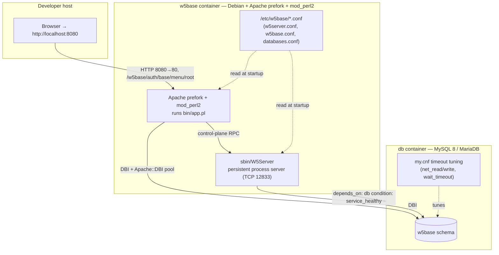

# W5Base Architecture Overview

W5Base (branded **Darwin**) is a **GPL-2.0, metadata-driven application/database
framework** that is most often deployed as a CMDB / ITSM platform; its largest
production user is Deutsche Telekom. The `README.txt` in the repository root
describes it succinctly as an *"Application/Database Framework ... build on
Apache, Mod_Perl2, MySQL"* (README.txt) — and that one sentence captures the
whole runtime: a **prefork Apache** server with an embedded **mod_perl2** Perl
interpreter, talking to a **MySQL 8 / MariaDB** database, with a companion
**persistent process server** (`sbin/W5Server`) handling background work. The
codebase is roughly **~41% JavaScript and ~29% Perl** (the JavaScript drives the
generated browser UI; the Perl is the kernel and the data-object modules).

This document is the **architecture map** for an engineer who has just brought
the containerized stack up (see [`./LOCAL_SETUP.md`](./LOCAL_SETUP.md)) and now
wants to understand *how the pieces fit together and why*. It explains the
central **metadata-driven** model, the **request path** of a web transaction,
the **control-plane** process server, the **schema-versioning** mechanism, the
**filesystem layout**, the **configuration model**, the **operation modes**, and
the **security posture** — and closes with a picture of the running containers.

> **This is a descriptive, read-only document.** It only *reads* and *references*
> application code (`lib/**`, `mod/**`, `sql/**`, `bin/app.pl`, `sbin/**`,
> `etc/**`); it changes nothing. The container environment described here is
> **purely additive** — it *invokes* W5Base's own utilities and *renders*
> configuration for them, but it never edits kernel logic or the schema
> contract. All examples below match the sibling environment artifacts exactly:
> install dir `/opt/w5base`, service user `w5base`, Compose services `w5base`
> (application) and `db` (database), host mapping `8080:80`, and the main-menu
> URL `/w5base/auth/base/menu/root`.

## Table of Contents

- [1. The Metadata-Driven Framework Model](#1-the-metadata-driven-framework-model)
- [2. The Request Path](#2-the-request-path)
- [3. The Control Plane: Why W5Server Is a Persistent Process Server](#3-the-control-plane-why-w5server-is-a-persistent-process-server)
- [4. Schema Versioning: TableVersionCheck](#4-schema-versioning-tableversioncheck)
- [5. Filesystem Layout](#5-filesystem-layout)
- [6. Configuration Model](#6-configuration-model)
- [7. Operation Modes](#7-operation-modes)
- [8. Security and Authentication Posture](#8-security-and-authentication-posture)
- [9. Runtime Topology](#9-runtime-topology)
- [10. Where to Go Next](#10-where-to-go-next)

---

## 1. The Metadata-Driven Framework Model

### The core idea

The single most important mental model in W5Base is this:

> **Declare a data object → get its UI mask, its REST/SOAP interface, and its
> relational persistence "for free."**

A developer does not hand-write a form, then a REST controller, then an SQL
schema, then a list view, then an Excel export. Instead they **declare a "data
object"** — a Perl module under `mod/<module>/` (for example
`mod/itil/appl.pm`) — that describes a set of **typed fields** and the object's
behavior. From that single declaration the framework **auto-generates**:

- the interactive **UI "masks"** (the create/edit forms and the filterable
  list/search screens the browser renders),
- the **REST and SOAP/WSDL interfaces** for the same object, and
- the **relational persistence** (the tables and columns the fields map to).

**Why is the framework built this way?** Because a CMDB/ITSM platform has
*hundreds* of related record types (applications, assets, contracts, contacts,
business processes, …). Writing bespoke UI + API + SQL for each one would be
enormous, inconsistent, and unmaintainable. By making the **field metadata the
single source of truth**, W5Base guarantees that every object automatically gets
a consistent UI, a consistent API, consistent filtering and export, and
consistent storage — and a new capability is added by *declaring metadata*
rather than by writing screens and endpoints. This is why there is almost no
per-screen UI code in the repository: the screens are generated.

### Domain vocabulary

A newcomer will meet these terms constantly:

| Term | Meaning |
|------|---------|
| **Data object** | A declared record type (a Perl module under `mod/<module>/`) that inherits the kernel base class and defines typed fields. |
| **Mask** | A **generated screen** — a form or a list/search view — produced from a data object's field metadata. There is one model; the mask is its rendered face. |
| **Mandator** | A **tenant / data-ownership boundary**. Records belong to a mandator, and access control is expressed per mandator. |
| **Field** | A single typed attribute of a data object (e.g. an `Id`, a `Text`, a `Date`, a `Link` to another object). Field *types* carry the behavior. |
| **TableVersionCheck** | The **schema-reconciliation** routine that brings the live database in line with the SQL each module ships (see §4). W5Base has no migration files. |
| **W5Server** | The **persistent control-plane process server** that runs asynchronous and atomic operations over TCP (see §3). |

### The kernel classes that make it work

The kernel lives in `lib/kernel/` (which, together with `mod/base`, *is* the
W5Base kernel). A few classes carry the whole model:

- **`kernel::DataObj`** (`lib/kernel/DataObj.pm`) is the base class every data
  object inherits, and at **~171 KB it is the largest file in the kernel** — a
  good hint at how much generated behavior lives here. Its inheritance is the
  key to the "one declaration, many faces" idea:

  ```perl
  package kernel::DataObj;
  @ISA = qw(kernel::App kernel::WSDLbase);
  ```

  Every data object is therefore **simultaneously an application handler**
  (`kernel::App` — so it can drive UI/behavior) **and SOAP/WSDL-exposable**
  (`kernel::WSDLbase` — so it is reachable as a web service). That dual
  inheritance is *exactly how one declaration yields both a UI mask and a
  web-service interface* without extra code.

- **`kernel::Field`** (`lib/kernel/Field.pm`, `@ISA = qw(kernel::Universal)`) is
  the field/attribute abstraction. A data object declares a list of **typed
  fields**, and the framework ships a **large catalog of field types** — about
  **70** of them under `kernel::Field::*`. Representative types include:

  `Id`, `Text`, `Textarea`, `Select`, `Boolean`, `Date`, `Email`, `Link`,
  `Password`, `Currency`, `Number`, `File`, `Contact`, `SubList`.

  Field types are what make generation possible: because each type knows how to
  render itself, how to be filtered, and how to serialize, the framework can
  assemble **masks, filters, and REST/SOAP payloads automatically** from the
  declared field list.

- **`kernel::App`** (`lib/kernel/App.pm`) is the base application/handler class:

  ```perl
  package kernel::App;
  @ISA = qw(kernel::Universal kernel::TemplateParsing);
  ```

  It is the common ancestor for a surprising range of things — not only
  `kernel::DataObj` and `kernel::EventController` (below), but even standalone
  admin tools such as `sbin/W5InstallCheck` (which declares
  `@ISA = ("kernel::App")`). This is why a CLI health-checker and a web data
  object can share the same configuration, database, and logging machinery.

- **`kernel::MandatorDataACL`** (`lib/kernel/MandatorDataACL.pm`) is the
  multi-tenant (**"mandator"**) **data access-control** layer. Its
  `expandByDataACL` routine resolves per-group / per-user **allow/deny
  field-group rules** (persisted through the `base::mandatordataacl` data
  object) so that **different tenants and roles see different subsets of
  fields** on the very same object. This is W5Base's **field-level
  authorization** layer — the reason two users can open the same record and be
  shown different columns.

- **`kernel::EventController`** (`lib/kernel/EventController.pm`,
  `@ISA = qw(kernel::App)`) is the **event dispatch** layer. Its `LoadEventHandler`
  and `ProcessEvent` routines run **asynchronous / atomic operations**, and it
  cooperates with W5Server's signal handling: on a soft restart it observes a
  `ServerGoesDown` flag so that **running events can finish cleanly** rather than
  being cut off. It is the bridge that carries work from a web or CLI request
  into the control plane described in §3.

---

## 2. The Request Path

This section traces a single web transaction end-to-end — say, a browser asking
for the main menu at
`${W5BASE_BASE_URL}/w5base/auth/base/menu/root` (with `${W5BASE_BASE_URL}`
being, for local development, `http://localhost:8080`).

```mermaid
sequenceDiagram
    autonumber
    participant B as Browser
    participant A as Apache (prefork) + mod_perl2
    participant P as sbin/ApacheStartup.pl (preloaded at boot)
    participant App as bin/app.pl
    participant K as kernel::App::Web
    participant S as sbin/W5Server (TCP)
    participant DB as db (MySQL 8 / MariaDB)

    Note over A,P: At server start, mod_perl runs the &lt;Perl&gt; block —<br/>set $W5V2::INSTDIR, then require ApacheStartup.pl (warm kernel)
    B->>A: GET /w5base/auth/base/menu/root
    A->>App: rewrite engine forwards to bin/app.pl
    App->>App: set OperationContext=WebFrontend,<br/>resolve INSTDIR, derive config "w5base" from URL
    App->>K: RunWebApp(INSTDIR, "w5base") then load /etc/w5base/w5base.conf
    K->>DB: DBI query via Apache::DBI connection pool
    K->>S: control-plane RPC for async / atomic work
    K-->>B: rendered mask (HTML) or REST/SOAP response
```

Walking the steps:

1. **The browser** hits a URL of the shape
   `${W5BASE_BASE_URL}/<config>/(public|auth)/<Mod>/<SubMod>/<Func>` — here
   `/w5base/auth/base/menu/root`.

2. **Apache (prefork MPM) with mod_perl2** receives it. The Apache **rewrite
   engine forwards all traffic to `bin/app.pl`**; the repository states plainly
   that *"All web transactions are started from `$W5BASEINSTDIR/bin/app.pl`"*
   through the rewrite engine (README.txt). The rewrite maps
   `.../<app>/(public|auth)/<Mod>/<SubMod>/<Func>` onto
   `app.pl?MOD=<Mod>::<SubMod>&FUNC=<Func>`.

3. **The kernel is already warm.** At server start, mod_perl executed the
   `<Perl>` block from the Apache config (mirrored from the sample
   `etc/httpd/perl.conf.mod_perl2`), which sets `$W5V2::INSTDIR` and
   `require`s `sbin/ApacheStartup.pl`. That startup script **prepends
   `$W5V2::INSTDIR/mod` and `$W5V2::INSTDIR/lib` to `@INC`** and then `use`s the
   core `base::*` modules (`base::start`, `base::MyW5Base`, `base::workflow`,
   `base::grp`, `base::user`, `base::menu`, `base::mandator`, `base::cistatus`,
   `base::load`, …). The result is a **warm interpreter shared across requests**,
   so each request pays no module-load cost. `PerlModule Apache::DBI` is also
   loaded, giving **database connection pooling** across requests.

4. **`bin/app.pl` runs.** It sets `$W5V2::OperationContext = "WebFrontend"`,
   resolves `$W5V2::INSTDIR` (default `/opt/w5base`, or the first entry of
   `$ENV{W5BASEINSTDIR}`), loads `lib/kernel/App/Web.pm`, **derives the config
   name from the URL**, and finally calls
   `kernel::App::Web::RunWebApp($W5V2::INSTDIR, $configname)`.

5. **URL → config-file mapping.** The **first URL path segment is the config
   name** — it is the level immediately above the `auth`/`public` namespace — so
   `/w5base/...` loads `/etc/w5base/w5base.conf` (README.ConfigParameters.txt).
   This is *why* the application config file is named `w5base.conf` and *why* the
   menu URL begins with `/w5base`: change the first segment and you select a
   different site configuration on the same server.

6. **The kernel resolves the request.** It loads the requested
   module/data-object, applies the mandator ACLs (§1), and renders the generated
   **mask** (HTML) or the REST/SOAP response.

### Why the prefork MPM is mandatory

**mod_perl2 requires the Apache _prefork_ MPM; it will fail on the threaded
worker/event MPM.** The repository's install recipe targets
`apache2-mpm-prefork` for exactly this reason. The *why* is short: mod_perl
**embeds a full Perl interpreter inside each Apache process**, and much of the
Perl module ecosystem W5Base relies on is not thread-safe. Prefork gives each
request a **separate process** with its own interpreter, which is the supported
and safe model. This is a **hard requirement, not a preference** — the container
explicitly disables the threaded MPM and runs prefork.

---

## 3. The Control Plane: Why W5Server Is a Persistent Process Server

`sbin/W5Server` is a **persistent TCP process server**. The
`W5Server.README.txt` states it is *"essentialy needed to process all asyncron
and atomic operation"* (W5Server.README.txt), and that Apache worker processes
and the `sbin/W5ServerClient` CLI **communicate with it over TCP**. Stated
plainly: **the W5Base web frontend requires a running W5Server** — the
repository's operating notes say the *"Web-Frontend needs a running
sbin/W5Server"* (README.txt). Without it, the application cannot process its
events and jobs.

### Why a separate, long-lived process (and not just per-request handlers)?

An HTTP request under mod_perl is **short-lived and isolated**: it starts, does
its work, and ends. That is fine for rendering a mask, but it is the wrong home
for work that must be:

- **atomic or serialized** across concurrent users (so two requests do not
  corrupt shared state),
- **scheduled or long-running** (nightly cleanup, quality checks, workflow
  timers) — work that would blow past an HTTP timeout, and
- **executed in a warm, shared space** that persists between requests.

Centralizing that work in **one long-lived process** solves all three at once:
it owns the atomic/serialized jobs, it survives far longer than any request, and
it keeps a warm execution context. That is *why* W5Server exists as a
standalone control plane rather than being folded into the web handlers.

### Operational contract (signals and access)

W5Server has a precise signal contract (W5Server.README.txt):

| Signal | Effect | Notes |
|--------|--------|-------|
| `USR1` | **Soft restart** | Reloads all module code; takes ~15 s with a brief listener interrupt; **running events finish cleanly**. |
| `USR2` | **Soft shutdown** | Sets the `ServerGoesDown` flag so running events can wind down before exit. |
| `INT`  | **Hard shutdown** | Kills running events immediately — **should be avoided**. |
| `HUP`  | **Hard restart** | **Not supported** by the developers; can cause strange effects. |

Access is restricted by the **`W5ServerAllow`** configuration option (default
`127.0.0.1`), because the server can invoke security-relevant jobs and must not
accept connections from arbitrary hosts. For horizontal scaling there is an
**experimental** secondary mode: if `W5PrimaryServerHost` / `W5PrimaryServerPort`
are set, a W5Server connects to a primary at startup to share event load across
logical servers.

### The three entry points

| Command | Role |
|---------|------|
| `sbin/W5Server` | **The server itself** — the persistent listener (default TCP port `12833`). |
| `sbin/W5ServerClient` | A **CLI** that initiates operations **inside the server's** process space. |
| `sbin/W5Event` | Runs events in the **caller's own** process space — used for the non-interactive schema build (§4). |

RPC transport between these pieces is provided by the vendored **`RPC::Smart`**
module (`sbin/W5Event` does `use RPC::Smart::Client`). In the containerized
environment the entrypoint starts **both** W5Server and Apache, and the smoke
test asserts that W5Server is up as one of its health signals.

---

## 4. Schema Versioning: TableVersionCheck

W5Base **does not use migration files.** Instead, **each module ships
version-aware DDL** under `sql/<module>/`, and the framework **reconciles the
live database against those scripts** through a routine called
**TableVersionCheck**. Conceptually: the SQL scripts declare the schema each
module expects at its current version, and `TableVersionCheck` walks them and
brings the database up to that state.

The environment runs it **non-interactively** with:

```bash
sbin/W5Event -c <config> -s -d -v TableVersionCheck
```

where the flags (from `sbin/W5Event`) mean:

- `-c <config>` — the configuration name (e.g. `w5server` or `w5base`),
- `-s` — **serverless**: a running W5Server is *not* required for this call,
- `-d` — **debug** output, and
- `-v` — **verbose** output.

Running it this way is **preferred over the web path** because building the
whole schema through the web frontend can hit a **web-server timeout**
(README.txt). Importantly, this run **executes the existing schema contract and
changes no SQL** — it is the framework's own mechanism, invoked as-is.

A **clean `TableVersionCheck`** (no schema errors) is **one of the five
environment health signals** the smoke test verifies (alongside W5Server being
up, the main menu rendering, `sbin/W5InstallCheck` reporting a healthy install,
and a **generated menu link resolving** under `/w5base` so the menu is proven
*navigable*, not merely rendered).

---

## 5. Filesystem Layout

W5Base separates **configuration** (kept outside the code tree, under
`/etc/w5base`) from the **install tree** (`$W5BASEINSTDIR`, set by the
`W5BASEINSTDIR` environment variable and defaulting to `/opt/w5base`). The table
below annotates the runtime layout the framework expects (grounded in
README.txt's development overview):

| Path | What lives here / why it matters |
|------|----------------------------------|
| `/etc/w5base` | **All configuration files.** In the container these are *rendered at startup*: `w5server.conf`, `w5base.conf`, and `databases.conf`. Kept outside the code tree so config and code version independently. |
| `$W5BASEINSTDIR/bin` | The **web-interface entry point** — `app.pl`, the target of the Apache rewrite (§2). |
| `$W5BASEINSTDIR/sbin` | **Admin tools and `W5Server`** — the control-plane server plus `W5Event`, `W5ServerClient`, `W5InstallCheck`, `CreateDatabaseUser`, `ApacheStartup.pl`, and more. |
| `$W5BASEINSTDIR/lib` | Kernel **libraries.** Per README.txt, *"this and mod/base is w5base kernel"* — i.e. **`lib/` together with `mod/base` is the W5Base kernel**. |
| `$W5BASEINSTDIR/mod/<MODULE>` | **Module program code** — the declared data objects (e.g. `mod/itil`, `mod/crm`). This is where features live. |
| `$W5BASEINSTDIR/sql/<MODULE>` | **Per-module SQL** consumed by `TableVersionCheck` (§4). |
| `$W5BASEINSTDIR/static` | **Static HTML/assets** distributed with the code. |
| `$W5BASEINSTDIR/skin` | **Frontend layout and language files** (the look and the translations). |
| `$W5BASEINSTDIR/etc/httpd` | **Sample** web-server config (e.g. `perl.conf.mod_perl2`) — a *reference pattern* only; the container generates its real vhost separately. |
| `$W5BASEINSTDIR/etc/w5base` | **Default/delivered** application config (`default.conf`) — reference values that need not be edited; the real container config is generated under `/etc/w5base`. |
| `$W5BASEINSTDIR/dependence` | **Vendored Perl module distributions** (built at image-build time only; contents are not inspected by this documentation). |

In addition to the install tree, the environment **creates these runtime
directories at startup**, owned by the `w5base` service user (set via the
`W5BASESRVUSER` environment variable):

- `/var/opt/w5base` — variable runtime data,
- `/var/opt/w5base/state` — **W5Server state** (matches `W5ServerState` in the
  config), and
- `/var/log/w5base` — **logs**.

> For module-level detail, see the dedicated docs rather than duplicating them
> here: [`./modules/kernel.md`](./modules/kernel.md) (the `lib/` + `mod/base`
> kernel), [`./modules/itil.md`](./modules/itil.md) (the large CMDB/ITSM
> module), and [`./modules/crm.md`](./modules/crm.md) (a compact representative
> module).

---

## 6. Configuration Model

W5Base configuration is a set of simple `KEY="value"` (and `KEY[index]="value"`)
assignments. A few properties are worth internalizing early
(README.ConfigParameters.txt):

- **Parameter names are case-insensitive** — you may write them in whatever case
  you like.
- **Most parameters have delivered defaults** in
  `$W5BASEINSTDIR/etc/w5base/default.conf`; that file need not be edited.
- **Config files support `INCLUDE`.** This is how both `w5server.conf` and
  `w5base.conf` pull in a shared `databases.conf` (`INCLUDE
  /etc/w5base/databases.conf`), so the database credentials live in exactly one
  place and are shared by the server and the frontend.

### Key parameters a newcomer must know

| Parameter | Purpose |
|-----------|---------|
| `DATAOBJCONNECT[w5base]` | The **DBI connect string** for the `w5base` data connection. In the container it points at the `db` service, e.g. `dbi:mysql:database=w5base;host=db`. |
| `DATAOBJUSER` / `DATAOBJPASS` | The database **user and password** for that connection. |
| `MASTERADMIN` | The `REMOTE_USER` name that is **always** treated as admin — *regardless of group membership* — used to **bootstrap** the system before user management is initialized (README.ConfigParameters.txt). |
| `SITENAME` | The human-readable application name (not the DNS name); default `W5Base`. |
| `AutoLoadMenuPath` | The menu path loaded when none is selected (default `MyW5Base`). |
| `W5ServerHost` / `W5ServerPort` / `W5ServerState` | Where the frontend reaches the control plane (`W5ServerPort` default **`12833`**) and where W5Server keeps its state. |
| `W5BaseOperationMode` | The application's **operation mode** (see §7); default `online`. |

### How the container renders these

The container **templates these values from environment variables** and never
hardcodes secrets:

- `W5BASE_ADMIN` → `MASTERADMIN`
- `W5BASE_DB_PASSWORD` → `DATAOBJPASS`
- the DB connection (host `db`, database `w5base`) → `DATAOBJCONNECT[w5base]`,
  consistent with `W5BASE_DSN`

Secrets (`W5BASE_DB_PASSWORD`, `W5BASE_ADMIN_PASSWORD`, …) are supplied through
the environment / Compose `env_file`, **not** committed to the repository. For
the exact variable list and values used locally, see
[`./LOCAL_SETUP.md`](./LOCAL_SETUP.md); the full parameter reference is
[`../README.ConfigParameters.txt`](../README.ConfigParameters.txt).

---

## 7. Operation Modes

`W5BaseOperationMode` selects how the application behaves at runtime. The
delivered `etc/w5base/default.conf` enumerates the documented values:

```text
W5BaseOperationMode = test | automodify | online | normal |
                      maintenance | offline | dev | slave | readonly
```

(the default is `online`), and `README.txt` documents an additional
`baseslave` mode. In brief:

| Mode | Purpose |
|------|---------|
| `online` / `normal` | **Live** operation — the normal running state. |
| `maintenance` / `offline` | **Restricted** access while work is performed. |
| `dev` | **Development** mode. |
| `test` / `automodify` | Test and auto-modify behaviors used during development/validation. |
| `readonly` | **Standby mirror**: point at a read-only MySQL replica; **no writes**. DB privileges are restricted so writes are impossible. |
| `slave` / `baseslave` | **Replication / read-only main tables.** In `baseslave`, **no TableVersionCheck runs**, and submodules can be disabled (a `.DISABLED` marker file, e.g. `base/W5Server/Cleanup.pm.DISABLED`) or set read-only/disabled per module via `MODULE[base::user]="READONLY"` / `"DISABLED"`. |

> **Critical operational rule:** the operation mode **must be set identically for
> _both_ W5Server _and_ the user frontend** (README.txt). A mismatch — for
> example a `readonly` frontend against a read-write server, or vice versa —
> produces inconsistent behavior. For `readonly`/`baseslave`, the database
> privileges themselves are also tightened so that write operations cannot occur.

The container exposes this setting through the `W5BASE_OPERATION_MODE`
environment variable, which `docker/entrypoint.sh` renders **identically** into
**both** rendered configs — `w5base.conf` (the frontend) and `w5server.conf`
(the control plane) — thereby satisfying the critical rule above by
construction. For local development it defaults to **`normal`** (a
live-operation mode, equivalent to `online` in the table above); the
repository's `etc/w5base/default.conf` ships `online`. Either live mode works so
long as the two configs match, which the single-variable rendering guarantees.

---

## 8. Security and Authentication Posture

W5Base uses a **delegated authentication** model: **Apache authenticates the
request** (here, via **HTTP Basic auth**) and passes the authenticated identity
to the application as `REMOTE_USER`. W5Base then maps the configured
**`MASTERADMIN`** value to the bootstrap administrator — the account that is
always admin, so an operator can reach every screen before user management has
been populated. In this environment, **`W5BASE_ADMIN` / `W5BASE_ADMIN_PASSWORD`
are that identity** (rendered into `MASTERADMIN` and the Basic-auth credential
store respectively).

Two deliberate constraints keep this base **minimal and safe**:

- **The legacy documented defaults must be changed.** The old README documents a
  default `dummy/admin` user with password `acache`, tied to the external
  `mod_auth_ae`/`acache` cache (README.txt). Those defaults are **not** used —
  the admin identity comes from `W5BASE_ADMIN` / `W5BASE_ADMIN_PASSWORD`, and no
  credential is hardcoded anywhere in the repository.
- **Oracle and LDAP are intentionally out of scope for this base.** Running
  Oracle (`DBD::Oracle`) and LDAP (`Net::LDAP`) *in the same process* is a
  documented **segmentation-fault hazard** (README.txt). Excluding them, and the
  fiddly external `mod_auth_ae`/OIDC auth stack, is *why* the container keeps
  authentication minimal (Basic auth + `MASTERADMIN`). Those integrations belong
  in a separate override environment, not in this base.

**Dependency and CVE posture (base images and patch tracking).** Both images are
**pinned** for reproducibility — the application image is `debian:12`
([`Dockerfile`](../Dockerfile)) and the database is `mariadb:10.11`
([`docker-compose.yml`](../docker-compose.yml), never `:latest`). Their Perl,
Apache, and MariaDB packages are the **distro-provided** versions that ship in
those point releases; there is therefore **no application-level dependency
manifest to bump** — the base is patched by *rebuilding on an updated upstream
Debian/MariaDB release* (`docker compose build --pull`), not by editing a
lockfile. Two things keep the exposure small in the meantime: the enabled Apache
module set is deliberately narrow (**prefork, perl, proxy, rewrite, auth_basic**
only — `http2`, `proxy_*`, `dav`, `ssl`, `md`, `ldap`, and `auth_digest` are
*not* enabled), and Oracle/LDAP are excluded as above. Known forward-looking
advisories against the pinned bases (for example, Apache `2.4.x` and the Perl
`IO::Compress`/`IO::Uncompress` archive helpers) are **tracked, not reachable in
the enabled runtime** — the narrow module set means the vulnerable code paths are
not exercised — and are cleared by the rebuild-on-upstream-release flow above
once fixed Debian packages are published. This is the intended maintenance model
for a canonical dev base, not an open defect.

---

## 9. Runtime Topology

At run time the stack is two cooperating containers. The **`w5base` application
container** (Debian + Apache prefork + mod_perl2) runs `bin/app.pl` *and* the
`W5Server` control-plane process, both reading the rendered `/etc/w5base/*.conf`.
The **`db` container** (MySQL 8 / MariaDB) holds the `w5base` schema and applies
the `my.cnf` timeout tuning. Application startup is **gated on database health**
so the entrypoint's `TableVersionCheck` never races an uninitialized database.



Both long-lived pieces must be up for the application to work: **Apache/mod_perl2**
serves the **synchronous** web traffic, while **W5Server** runs the
**asynchronous / atomic** control-plane work over TCP. The smoke test
(`tests/smoke/w5base_smoke_test.sh`) checks exactly this pairing — plus a clean
`TableVersionCheck` and a healthy `W5InstallCheck` — before declaring the
environment ready.

---

## 10. Where to Go Next

- **Run the stack:** [`./LOCAL_SETUP.md`](./LOCAL_SETUP.md) — the one-command
  onboarding runbook, first login, and troubleshooting.
- **Understand the kernel:** [`./modules/kernel.md`](./modules/kernel.md) —
  the `lib/` + `mod/base` kernel in depth.
- **Representative modules:** [`./modules/itil.md`](./modules/itil.md) (the large
  CMDB/ITSM module) and [`./modules/crm.md`](./modules/crm.md) (a compact
  module).
- **Root quick start:** [`../README.md`](../README.md) — the containerized
  dev-environment pointer.
- **Legacy references (authoritative, verbose):**
  [`../README.txt`](../README.txt) (the original install/operation guide),
  [`../README.ConfigParameters.txt`](../README.ConfigParameters.txt) (the full
  configuration-parameter reference), and
  [`../W5Server.README.txt`](../W5Server.README.txt) (the W5Server operating
  manual).

---

*This document is descriptive and read-only. It references the W5Base kernel and
modules to explain the architecture; it modifies no application logic, no schema,
and no existing configuration. All commands, URLs, ports, paths, and variable
names above match the sibling container artifacts so there are no contradictions
between the documentation and what the environment actually does.*

